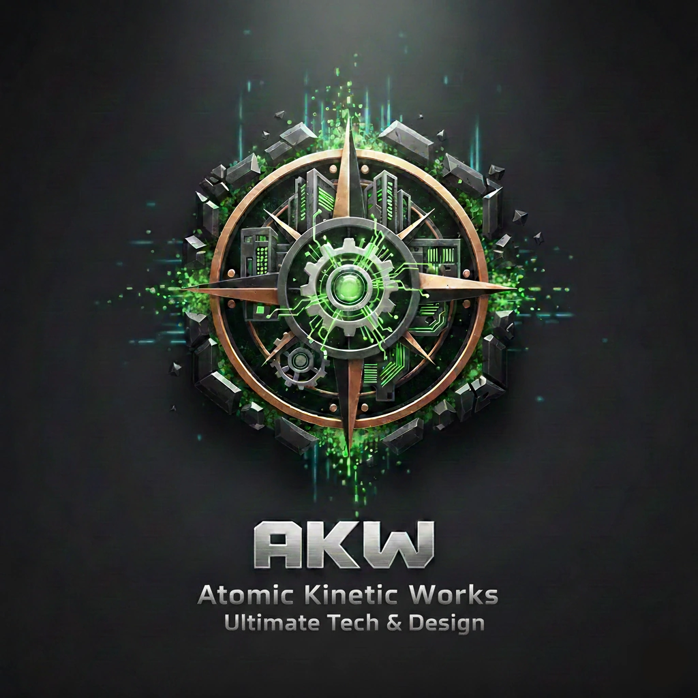

# ⚡ AKW: Ultimate Tech & Design

<table>
  <tr>
    <td width="280">
      
    </td>
    <td>
      <h3>Das ultimative Modpack für Visionäre</h3>
      

        <strong>AKW</strong> kombiniert komplexe Industrietechnik mit modernsten Design-Tools auf der stabilen <strong>NeoForge 1.21.1</strong>. 
        Erschaffe gigantische Fabriken, automatisiere alles und baue mit Werkzeugen, die deine Vorstellungskraft sprengen.
      

      

        📧 <strong>Kontakt:</strong> <a href="mailto:MCGithubDE@gmx.de">MCGithubDE@gmx.de</a> 
        🚧 <strong>Status:</strong> In Entwicklung
      

    </td>
  </tr>
</table>

---

## 🚀 Die Highlights

### ⚙️ Automation & High-Tech
* **Create & Add-ons:** Nutze kinetische Energie, baue Schienensysteme und Diesel-Generatoren.
* **Mekanism & AE2:** High-End Ressourcenverarbeitung und digitales Speichermanagement für Profis.
* **ComputerCraft:** Automatisiere deine Welt mit programmierbaren Computern und Turtles.

### 🏗️ Professionelles Bauen
* **Axiom & WorldEdit:** Nutze die mächtigsten Editoren direkt im Spiel für monumentale Bauwerke.
* **Architect's Palette & FramedBlocks:** Unendliche Möglichkeiten durch neue Texturen und frei formbare Blöcke.
* **Deco & Lighting:** Verschönere deine Basis mit *Decocraft*, *ManyIdeas* und *Simply Light*.

### ⚡ Performance & Grafik
* **Distant Horizons:** Erlebe epische Sichtweiten (LODs), die weit über das Standard-Limit hinausgehen.
* **Optimiert:** Dank *Sodium*, *Iris*, *ModernFix* und *FerriteCore* läuft dein Spiel flüssig bei maximalen FPS.
* **Immersion:** Realistische Sounds und Partikeleffekte (*AmbientSounds*, *Immersive Winds*) lassen dich tiefer in die Welt eintauchen.

---

## 🛠️ Installation & Setup
* **Empfohlener RAM:** **6 GB bis 8 GB** für ein flüssiges Erlebnis.
* **Version:** Minecraft 1.21.1 (NeoForge).
* **Tipp:** Dank des *Sinytra Connectors* bietet dieses Pack eine außergewöhnliche Mod-Kompatibilität!

---

## 🐞 Support & Issues
Du hast einen Fehler gefunden? Bitte nutze unseren **[Issue Tracker](../../issues)**.
Für private Anfragen: `MCGithubDE@gmx.de`

---

## ⚖️ Credits & Disclaimer
Alle enthaltenen Mods sind Eigentum ihrer jeweiligen Urheber. Dieses Modpack ist lediglich eine kuratierte Zusammenstellung. Sollte ein Mod-Entwickler mit der Aufnahme seiner Mod in dieses Pack nicht einverstanden sein, bitte ich um eine kurze Nachricht an meine E-Mail, damit ich sie umgehend entfernen kann.
