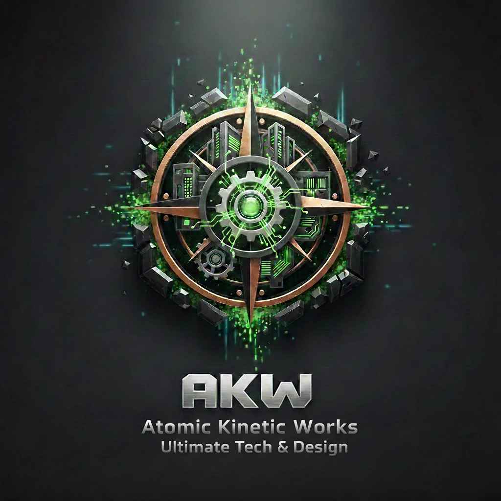

# ⚡ AKW: Atomic Kinetic Works | Ultimate Tech & Design

<table>
  <tr>
    <td width="300">
      
    </td>
    <td>
      <h3>Das ultimative Modpack für Visionäre</h3>
      

        <strong>Atomic Kinetic Works (AKW)</strong> ist die nächste Generation der Minecraft-Ingenieurkunst. Auf der stabilen Basis von <strong>NeoForge 1.21.1</strong> vereinen wir komplexe Industrietechnik mit den mächtigsten Design-Tools der Modding-Geschichte.
      

      

        Erschaffe gigantische Fabriken, automatisiere jeden Prozess bis zur Perfektion und baue mit Werkzeugen, die keine Grenzen kennen.
      

      

        📧 <strong>Kontakt:</strong> <a href="mailto:MCGithubDE@gmx.de">MCGithubDE@gmx.de</a> 
        🚧 <strong>Status:</strong> In aktiver Entwicklung
      

    </td>
  </tr>
</table>

---

## 🚀 Die Highlights

### ⚙️ Automation & High-End Tech
* **Create & Add-ons:** Meistere kinetische Energie, baue komplexe Schienensysteme und nutze Diesel-Power.
* **Mekanism & AE2:** High-End Ressourcenverarbeitung und digitales Speichermanagement für höchste Effizienz.
* **ComputerCraft:** Übernimm die volle Kontrolle mit programmierbaren Computern und autonomen Turtles.
* **Sinytra Connector:** Maximale Kompatibilität durch die Verschmelzung von Mod-Welten.

### 🏗️ Revolutionäres Bauen & Design
* **Axiom & WorldEdit:** Nutze Profi-Editoren direkt im Spiel für monumentale Bauwerke in Rekordzeit.
* **Architect's Palette & FramedBlocks:** Unendliche Gestaltungsmöglichkeiten durch neue Texturen und frei formbare Blöcke.
* **Deco & Lighting:** Perfektioniere deine Basis mit *Decocraft*, *ManyIdeas* und *Simply Light*.

### ⚡ Performance & Immersion
* **Distant Horizons:** Erlebe atemberaubende Sichtweiten (LODs), die deinen Horizont buchstäblich erweitern.
* **Maximale FPS:** Dank *Sodium*, *Iris*, *ModernFix* und *FerriteCore* bleibt das Erlebnis flüssig.
* **Lebendige Welt:** Realistische Soundkulissen und Partikeleffekte (*AmbientSounds*, *Immersive Winds*) für volle Immersion.

---

## 🛠️ Installation & Setup
* **Version:** Minecraft 1.21.1 (NeoForge).
* **RAM-Zuweisung:** Empfohlen sind **6 GB bis 8 GB** für ein stabiles Spielerlebnis.
* **Grafik:** Shader werden dank *Iris* nativ unterstützt und empfohlen.

---

## 🐞 Support & Feedback
Fehler gefunden oder Verbesserungsvorschläge?
* **Issue Tracker:** Melde Bugs direkt hier in den **[Issues](../../issues)**.
* **Kontakt:** Für private oder geschäftliche Anfragen: `MCGithubDE@gmx.de`

---

## ⚖️ Credits & Disclaimer
Alle enthaltenen Mods sind Eigentum ihrer jeweiligen Urheber. Dieses Modpack ist eine sorgfältig kuratierte Zusammenstellung.
*Falls ein Mod-Entwickler mit der Aufnahme seiner Arbeit nicht einverstanden ist, bitte ich um eine kurze Nachricht per E-Mail, um die Mod umgehend zu entfernen.*
